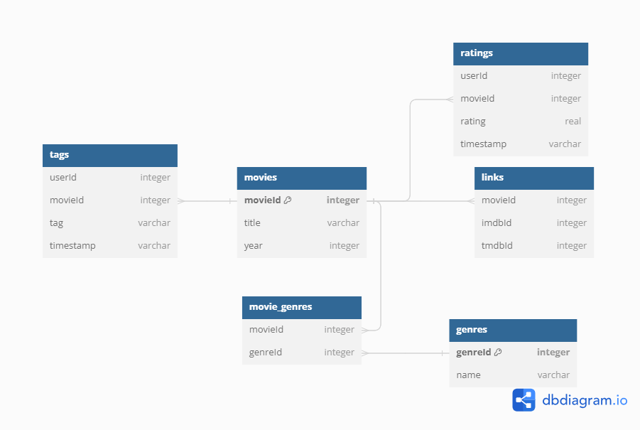

# Movie Recommendation System

## Introduction
This project aims to develop a web-based movie recommendation system that leverages content-based filtering to suggest movies to users. The system will also feature a unique quadrant graph to visually represent movie options based on popularity and genre similarity. This is an entry-level project designed to showcase practical application of data analysis, machine learning, and full-stack web development skills.

## Technologies Used
- **Frontend**: JavaScript, HTML, CSS
- **Backend**: Python (Flask/Django)
- **Database**: SQL
- **Data Analysis and Machine Learning**: Pandas, NumPy, Scikit-Learn
- **Visualization**: JavaScript libraries (e.g., D3.js, Chart.js)
- **Version Control**: Git, GitHub

## Dataset
The datasets used in this project are sourced from Kaggle and include:
- `movies.csv`: Contains movie titles, genres, and identifiers.
- `ratings.csv`: User ratings for movies.
- `links.csv`: External links to movie databases like IMDb and TheMovieDB.
- `tags.csv`: User-generated tags for movies.

## Setup Instructions
To set up and run this project locally, follow these steps:
1. Clone the repository: `git clone [repository URL]`
2. Install the required Python libraries: `pip install -r requirements.txt`

## Features
- Content-based movie recommendations based on user preferences.
- Interactive quadrant graph for exploring movies by popularity and genre similarity.
- User-friendly web interface for easy interaction with the system.

## Database Schema

The database schema for the movie recommendation system is designed to support efficient content-based filtering and data visualization. It includes tables for movies, genres, ratings, tags, and external links.

Below is the visual representation of the schema:

